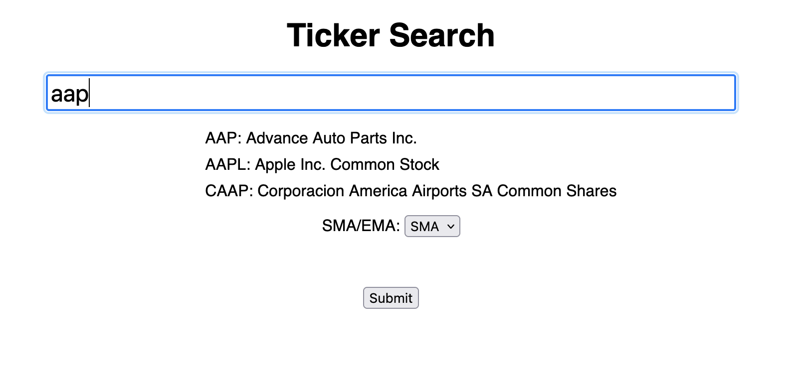
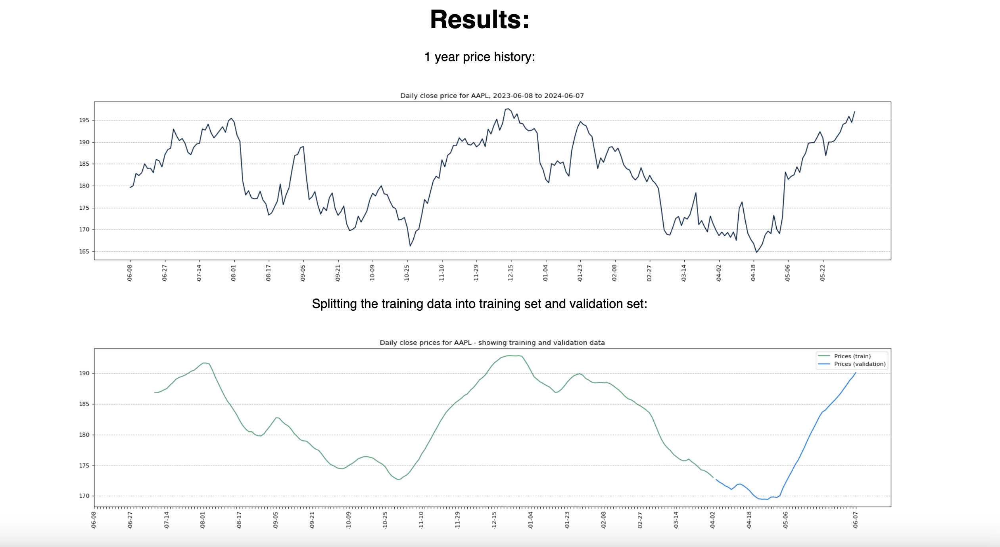
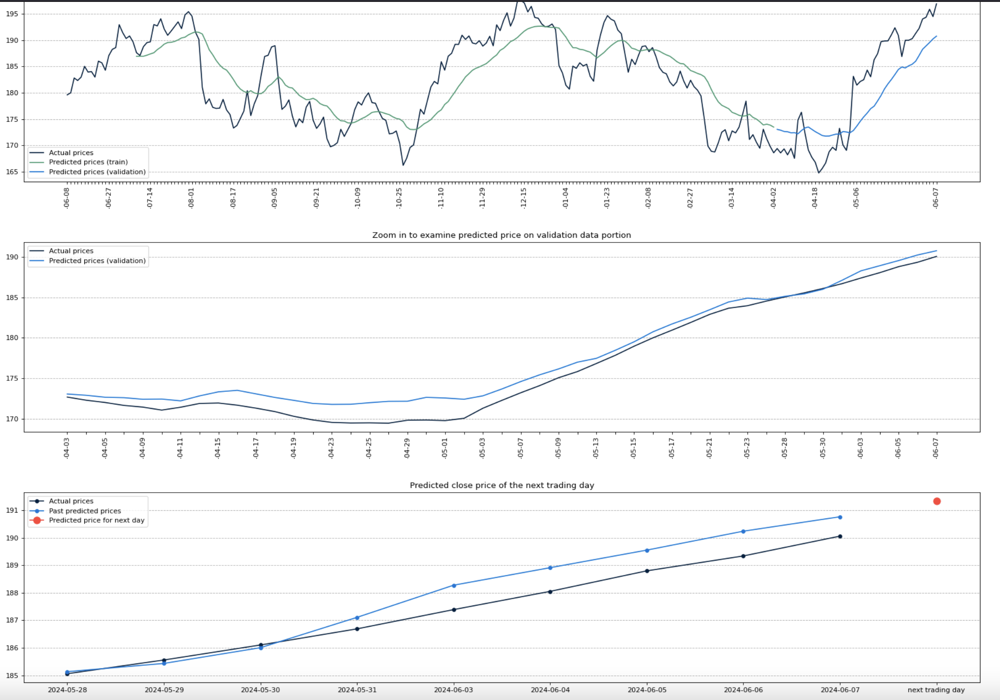
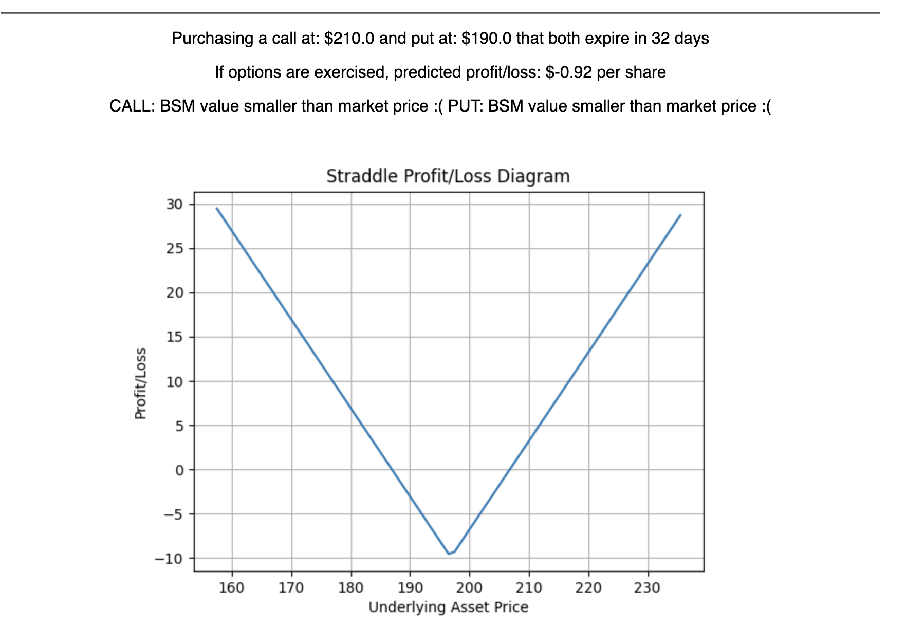

An application that predicts stock prices using an LSTM model, then uses multi-leg options strategies (collar/strangle/straddle) to predict a potential profit/loss.

Use a simple moving average (SMA) or exponential moving average (EMA) to help! Select from a large number of public companies. 
See: price history; how the data was split; predicted prices for the next day and the predicted price in a month; option pricing for the options strategies AND the Black-Scholes Merton values for both puts and calls.

Note: the Black-Scholes Merton formula assumes the ticker does not have any derivatives.
This is only for demonstrative purposes, and may not provide an accurate prediction.

Here is an example taken from the date June 10, 2024:
First, search through the list of public companies.

Then the results will be added to the page:

Using an LSTM model that has been trained on price history, predict the price on the next trading day.

Also, there is a predicted price for the next month listed (not in screenshot above)

Finally, using the predicted price for the later date, try to predict profit/loss.
